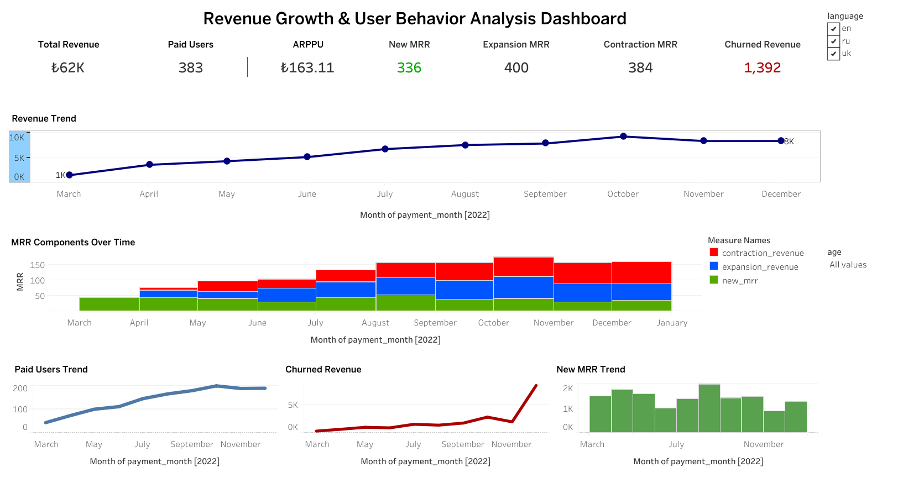

# Revenue Growth & User Behavior Analysis Dashboard

This project analyzes revenue growth and user behavior using SQL and Tableau Public.

The dashboard was developed as part of the GoIT Data Analytics final project and focuses on monthly recurring revenue (MRR), paid user behavior, churn analysis, and revenue trends.

---

## Tools & Technologies

- PostgreSQL
- SQL
- Tableau Public

---

## Project Objectives

- Analyze monthly revenue growth
- Track paid user behavior
- Measure churn and revenue loss
- Identify expansion and contraction revenue
- Visualize business KPIs using interactive dashboards

---

## KPIs Included

- Monthly Recurring Revenue (MRR)
- Paid Users
- Average Revenue Per Paid User (ARPPU)
- New MRR
- Expansion Revenue
- Contraction Revenue
- Churned Revenue
- Churn Rate
- Revenue Churn Rate
- Customer Lifetime Value (LTV)

---

## Filters Used

- Date
- User Language
- User Age

---

## Dashboard Features

- Revenue trend analysis
- Paid user trend analysis
- Monthly MRR component comparison
- Churn analysis
- Interactive filtering
- Revenue change tracking over time

---

## SQL Analysis

The SQL script calculates:

- New MRR
- Expansion Revenue
- Contraction Revenue
- Churned Revenue
- Back-from-churn revenue
- Monthly revenue metrics

SQL file:

`sql/project_2_mrr_analysis.sql`

---

## Dashboard Preview

---

## Tableau Public Dashboard

[View Dashboard on Tableau Public](https://public.tableau.com/app/profile/esra.can/viz/Esra_Can_Revenue_Dashboard/Dashboard1#1)

---

## Author

Esra Can

---

# Gelir Büyümesi ve Kullanıcı Davranışı Analizi Dashboard'u

Bu proje, SQL ve Tableau Public kullanılarak gelir büyümesi ve kullanıcı davranışlarının analiz edilmesini amaçlamaktadır.

Dashboard, GoIT Data Analytics final projesi kapsamında geliştirilmiştir ve aylık tekrar eden gelir (MRR), ücretli kullanıcı davranışları, churn analizi ve gelir trendlerine odaklanmaktadır.

---

## Kullanılan Teknolojiler

- PostgreSQL
- SQL
- Tableau Public

---

## Proje Amaçları

- Aylık gelir büyümesini analiz etmek
- Ücretli kullanıcı davranışlarını incelemek
- Churn ve gelir kaybını ölçmek
- Expansion ve contraction revenue değerlerini belirlemek
- İş metriklerini interaktif dashboard ile görselleştirmek

---

## Dashboard İçerisindeki KPI’lar

- Monthly Recurring Revenue (MRR)
- Paid Users
- Average Revenue Per Paid User (ARPPU)
- New MRR
- Expansion Revenue
- Contraction Revenue
- Churned Revenue
- Churn Rate
- Revenue Churn Rate
- Customer Lifetime Value (LTV)

---

## Kullanılan Filtreler

- Tarih
- Kullanıcı Dili
- Kullanıcı Yaşı

---

## Dashboard Özellikleri

- Gelir trend analizi
- Ücretli kullanıcı trend analizi
- Aylık MRR bileşen karşılaştırmaları
- Churn analizi
- İnteraktif filtreleme
- Zamana göre gelir değişim takibi

---

## SQL Analizi

SQL sorgusu aşağıdaki metrikleri hesaplamaktadır:

- New MRR
- Expansion Revenue
- Contraction Revenue
- Churned Revenue
- Back-from-churn revenue
- Aylık gelir metrikleri

SQL dosyası:

`sql/project_2_mrr_analysis.sql`

---

## Dashboard Önizleme

---

## Tableau Public Dashboard Linki

[Dashboard'u Tableau Public Üzerinde Görüntüle](https://public.tableau.com/app/profile/esra.can/viz/Esra_Can_Revenue_Dashboard/Dashboard1#1)

---

## Yazar

Esra Can
